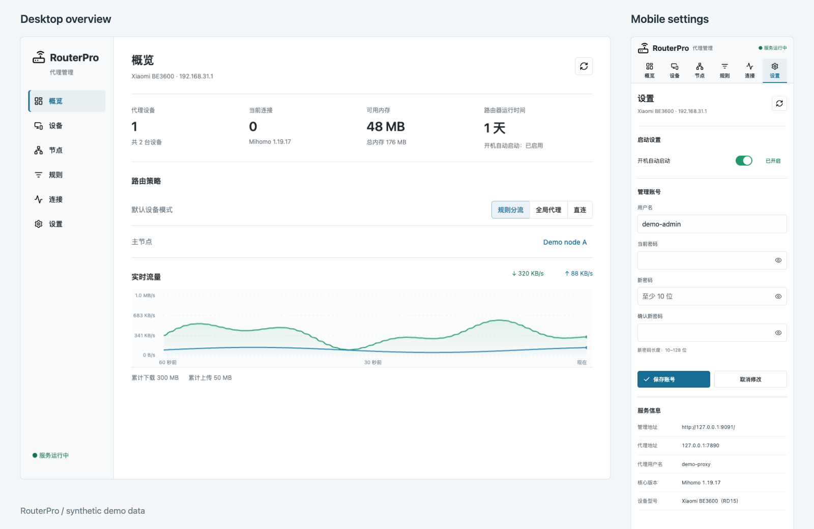

#  RouterPro

[🌐 English](README.md) | [🇨🇳 简体中文](README.zh-CN.md)

RouterPro brings software-router-style proxy management to **Xiaomi BE3600 2.5G (RD15)** without flashing firmware or adding another gateway. Keep the stock system while managing per-device routing, proxy nodes, strategy groups and subscriptions from one browser console.

🤗 We recommend using AI tools to assist with deployment and further development, adapting RouterPro to your network and needs.

## 📡 Hardware and Access

The verified device uses stock firmware **1.0.87**, ARMv7, an OpenWrt 18.06-derived system and Linux 5.4. Approximately 176 MiB of RAM is visible to Linux; this is different from advertised hardware capacity.

The console is at `http://192.168.31.1:9091/`. The HTTP/SOCKS proxy listens on `7890`, and the authenticated core API listens on `9090`.

This setup uses unlocked root SSH on stock firmware, following [this Enshan forum article](https://www.right.com.cn/forum/thread-8485993-1-1.html). It does not flash OpenWrt. See [Root SSH and references](docs/SSH.md) for the method and connection commands.

## ✨ Features

- Per-device rule, global, direct or inherited routing, plus a protected computer that remains direct.
- Nodes: share-link import, batch import, editing of imported nodes, deletion, pinning, search and link copying.
- Strategy groups: manual selection, automatic best-response selection, fallback and load balancing; node and subscription membership management.
- Subscriptions: native V2Ray/Clash parsing, individual/all updates and hourly, six-hourly or daily schedules. Failed updates retain existing nodes.
- Basic, YouTube and X HTTP response tests, sorting and cancellable batch testing with two concurrent nodes.
- Searchable rules, connections grouped by device and a live traffic chart with a polling fallback.
- Settings: boot toggle, separate management credentials, password visibility, reset, saving feedback and inline errors.
- Desktop/mobile layouts, resizable columns, persisted page/results, short interaction animations and reduced-motion support.

HTTP tests measure response time, not bandwidth. Original snapshot nodes retain their existing configuration; add a managed subscription to enable source updates.

## 🗂️ Project Layout

| Directory | Purpose |
| --- | --- |
| `web/` | Browser application, styles, icons and authenticated Lua CGI endpoints |
| `router/` | Configuration worker, jobs, firewall, service and boot scripts |
| `tools/` | Private configuration preparation and dashboard launcher |
| `tests/` | Import, UI, settings, traffic and live-router checks |
| `docs/` | Architecture, deployment conventions and root SSH references |

Router paths and service/firewall names retain `rd15-proxy` / `RD15P_*` for compatibility with the running installation.

## 🖥️ Preview



[Desktop overview](docs/assets/overview.png) · [Mobile settings](docs/assets/settings-mobile.png)

*Synthetic demo data only. No real accounts, devices or subscriptions are shown.*

## 🧪 Development and Checks

The frontend has no build step. Run local syntax and parser checks with:

```sh
npm install
npm test
npm run check
```

Browser checks require the existing router console and a private credentials file **outside the repository**:

```sh
npx playwright install chromium
export ROUTERPRO_ACCESS=/absolute/path/outside/repository/access.json
npm run test:ui
```

Screenshots go to the ignored `artifacts/` directory. Use `CHROME_EXECUTABLE` to select an existing browser. UI writes are mocked; these checks still read the live router and use installation-specific device fixtures.

`npm run test:router` creates and removes temporary groups/subscriptions and reloads the real configuration. It needs the `rd15` SSH alias and a router-accessible `ROUTERPRO_FIXTURE_HOST`. Proxied connections may briefly reconnect. Do not run this check during uninterrupted network use.

## 🔐 Deployment and Private Data

This repository is the source for an existing installation, not a universal router installer. Deployment requires a privately prepared Mihomo SquashFS bundle and runtime configuration. See [Architecture and deployment](docs/ARCHITECTURE.md).

No real passwords, controller keys, subscription URLs, node configurations or router-state files are committed. Private state and generated artifacts are ignored. Parser tests use synthetic `example.com` links, fake UUIDs and test-only passwords.

Lucide icons are provided under the [ISC license](web/icons/LICENSE).
